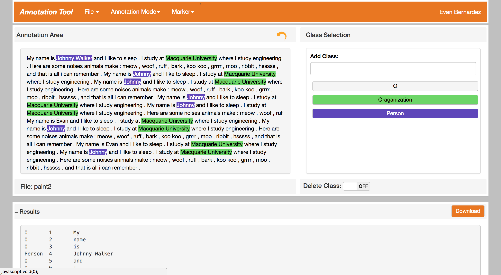

# Data Annotation Tool
A semi-automated tool for annotating english text.

## Technology Requirements
  - Python3:
		- Linux: http://python-guide-pt-br.readthedocs.io/en/latest/starting/install3/linux/
		- Windows: https://www.python.org/downloads/windows/
		- OSx: https://www.python.org/downloads/mac-osx/ 
  - Bottle
		- http://bottlepy.org/docs/dev/tutorial.html#installation
  - NLTK
		- http://www.nltk.org/install.html


## Run locally 
To start, run main.py from the data-annot-tools directory using python3:    
```bash
python3 main.py
```

## Clearing sessions
The database currently has no mechanism for clearing the session memory. The only option at this stage is to run the following command:
```bash
python3 database.py
```

## Screenshot



